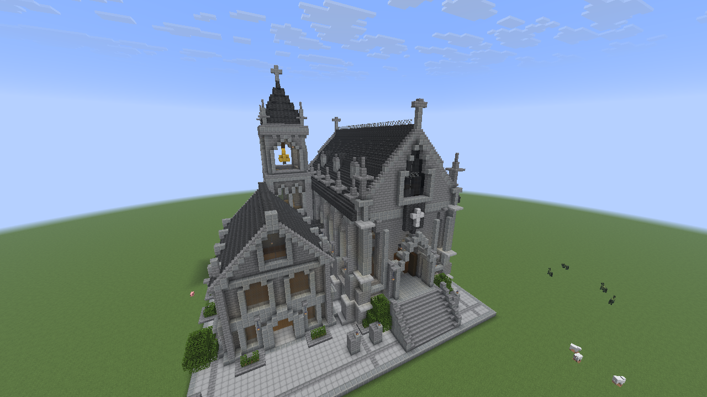
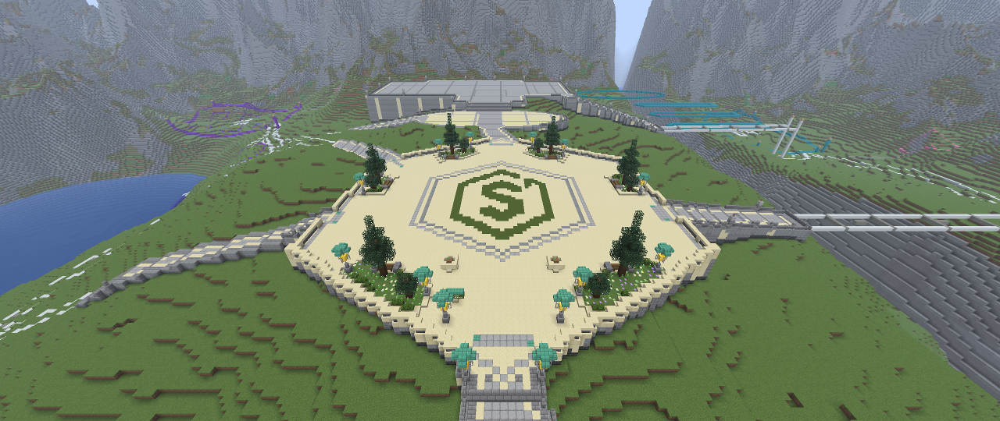
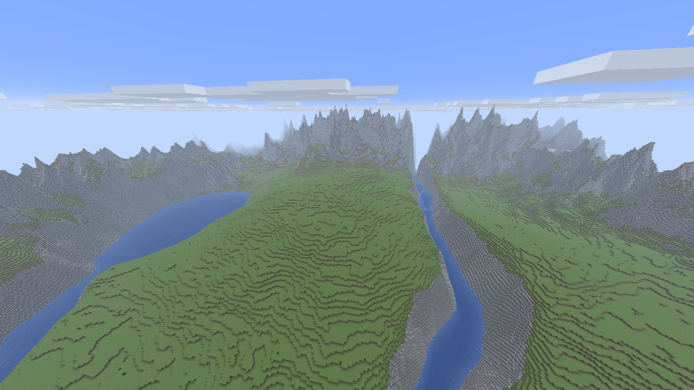

# minecraft-builder-mcp

A Minecraft building editor for collaboration between a human and an AI agent.



An unedited in-game capture of our Gothic hall: 30,125 blocks and 53 lanterns. See the [build report](docs/builds/GOTHIC_HALL.md) for the reference, checked incremental edits, and dusk and interior photos.

Working prototype: a Paper plugin, an editing core, an MCP/ACP Bridge, and a Fabric camera mod. Building, conflicts, undo, crash recovery, and `.schem` have been tested against local Paper through HTTP and real MCP stdio. The camera has been tested in Prism with one client: a real 1280×720 PNG was delivered through MCP. Dedicated ChatGPT sign-in, in-game text replies, and a real one-block build → inspect → undo cycle through ACP have also been verified.

## Features

- Reads bounded regions and builds boxes, lines, cylinders, and repeated elements.
- Saves a plan before applying it in slices with live block checks. Manual changes stop conflicting writes; undo also checks the current world state.
- Keeps an on-disk journal, distinguishes request retries from new operations, and stops ambiguous operations after a crash.
- Saves named parts and their protection, and exports/imports a limited Sponge v2 `.schem` subset through the same planning engine.
- Provides 19 MCP tools and `/ai` game chat through a pinned `codex-acp` adapter.
- Discovers the running server's complete vanilla block and item catalog on demand; ordinary recipes accept every registered block type and its valid states.
- Captures real images through a local worker on a spectator client. A single client with the owner temporarily in spectator has also been tested.
- Exports real north-up world surface maps without a player through the optional terrain plugin; applies reversible, terrain-following site layouts with checked snapshots.

The current scope is one owner, one project, and one world, with at most 4096 blocks per plan and loaded chunks only. A complete delta history, automatic merging of manual edits, and the full design document are not implemented yet. [Detailed status and limitations](docs/IMPLEMENTATION.md).

Material discovery stays compact: `project_context` returns catalog counts and a version, `material_search` returns 16 results by default (32 maximum), and `material_describe` returns the exact default state and property values for one chosen material. No full registry or list of every state combination is injected into the model context. This includes carpets, trapdoors, pots, candles, doors, redstone, fluids and waterlogged states when registered by the running Minecraft version. Item-only materials are searchable but cannot be placed as blocks. Existing block-entity data is preserved for same-material state edits and checked through opaque snapshot hashes; there is no arbitrary NBT, inventory or sign-text editor. [Material discovery and building rules](docs/MATERIALS.md).

Block support does not replace placement design: doors, beds and tall plants need all their parts, attachments need support, and decorative leaves should normally use `persistent=true`. Terrain brushes still reject fluids and structures in their scan. The `.schem` codec accepts registered block states but rejects entity/block-entity payloads and refuses to export block entities. World checkpoints remain necessary for complete landscaped builds and their extra data.

## Shacraft lobby construction

The clock station in zone 02 now contains a furnished vestibule, a SMASH selection floor and a two-stop lift, with unfinished upper spaces closed. See the [station photographs and verification](docs/SHACRAFT-STATION.md). For future work, use the [decoration playbook](docs/DECORATION-PLAYBOOK.md), [14 practical recipes](docs/DECORATION-RECIPES.md) and [structured recipe catalog](docs/recipes/decorations.json).

The arrival square is finished with the real Shacraft emblem, hexagonal paving, evergreen flower beds, benches, copper-hood lanterns, stone urns and a welcome board. A cream-capped balustrade frames the square. An independently reversible invisible enclosure currently keeps normal players inside zone 01, including at its five road approaches and above the square; the configured lobby spawn remains inside. The station foundation, local roads and broad stairs are ready; other districts remain marked reservations. [Completed zone 01 and containment verification](docs/SHACRAFT-ZONE01-COMPLETE.md) · [Balustrade](docs/SHACRAFT-BALUSTRADE.md) · [Arrival garden](docs/SHACRAFT-ARRIVAL-GARDEN.md) · [Foundations and elevations](docs/SHACRAFT-FOUNDATIONS.md) · [Earlier site survey](docs/SHACRAFT-LOBBY-LAYOUT.md).



## Build

Verified environment: Linux x64, Minecraft/Paper 26.2, Java 25, and Node.js 22.22.3+. From the repository root:

```bash
./scripts/build.sh
```

The script downloads pinned JDK 25.0.2 and Maven 3.9.11 into the user cache with hash verification, installs Bridge dependencies from the lockfile, and builds all three components with tests. It does not replace system Java. Python 3, Node.js, and npm must already be installed. [Pinned versions](docs/compatibility.json).

Build outputs:

- `paper-plugin/target/paper-plugin-0.1.0-SNAPSHOT.jar` — server plugin, including the editing core.
- `camera-mod/build/libs/minecraft-builder-camera-0.1.0-SNAPSHOT.jar` — client mod.
- `bridge/dist/` — executable MCP/ACP components.
- `terrain-world-plugin/target/terrain-world-plugin-0.1.0-SNAPSHOT.jar` — optional separate-world generator and read-only surface map exporter.

## Local setup

1. Prepare a separate test Paper server. On first installation, read the [Minecraft EULA](https://www.minecraft.net/eula), then explicitly accept it:

   ```bash
   python3 scripts/dev-server.py --accept-eula --run
   ```

   For subsequent runs, use `python3 scripts/dev-server.py --run`. The server lives in `.runtime/server`, listens on `127.0.0.1:25575`, and keeps Minecraft authentication enabled. The user has accepted the EULA for the server already prepared in this workspace.

2. Connect a Minecraft Java 26.2 client to `127.0.0.1:25575`. In **that server's** console, grant your game account operator access with `op <name>`. In the game, run:

   ```text
   /ai setup
   /ai area here
   ```

   The second command selects an area around the player. Chunks needed for the edit and its checked surroundings must be loaded. Set exact bounds with `/ai area minX minY minZ maxX maxY maxZ`.

3. From another terminal at the project root, check the settings and sign in to the separate Codex profile:

   ```bash
   python3 scripts/bridge.py doctor
   python3 scripts/bridge.py login
   python3 scripts/bridge.py login --status
   ```

   The user completes sign-in using a device code. The helper reads local Paper tokens without printing them. It does not copy the normal `~/.codex` profile; project state lives in `.runtime/bridge-state`. After starting chat, test an actual MCP read to verify the local connection and model tool access.

4. Start chat:

   ```bash
   python3 scripts/bridge.py chat
   ```

   You can now send `/ai Build a small tower next to me`. Set `MCB_MODEL` to choose a model; otherwise the adapter chooses. `/ai status` reports status, and `/ai stop` stops further writes and the agent request. Changes already made require a separate checked undo.

Connect MCP to an external client using `python3 scripts/bridge.py mcp`. Owner scope comes from the Paper configuration. This command is intended for a client that launches MCP over stdio, rather than an interactive terminal.

## Camera

An ordinary player does not need the mod. For the observer, install the pinned Fabric Loader and API versions and add the camera JAR to a separate 26.2 profile. Before launching, pass `MCB_CAMERA_TOKEN` from the plugin's private `camera-token` setting to that process; set `camera-player-uuid` in Paper and restart the server. The observer must connect in spectator mode.

If the builder and observer play simultaneously, they need valid separate game sessions. With one client, set the camera UUID to the owner's UUID and temporarily enable spectator mode. This scenario has been verified in the Prism profile **26.2 MCP Building**; `scripts/camera-wrapper.py` passes the secret to Java without adding it to Prism's logged variables. See the [camera instructions](camera-mod/README.md) for the exact procedure and capture limitations. Once connected, `/ai camera save name` saves the owner's viewpoint. [Local single-client test results](docs/ONE_CLIENT_TEST.md).

## Tests and documentation

```bash
./mvnw test
npm --prefix bridge test
JAVA_HOME="$HOME/.cache/minecraft-builder-mcp/jdk-25.0.2" camera-mod/gradlew --project-dir camera-mod test
```

`python3 scripts/live-server-test.py` starts and stops its own process in `.runtime/server`, checks conflicts and undo, deliberately terminates that process to test recovery, and then exercises MCP and `.schem`. First build the project, run the plugin once, and accept the EULA; any existing server must be stopped. This test targets the prepared test world and changes only bounded test regions. Results are saved in `.runtime/live-server-results.json` and `.runtime/live-mcp-results.log`.

- [Project design and future phases](docs/DESIGN.md).
- [Implementation status and verification](docs/IMPLEMENTATION.md).
- [Runtime materials and compact discovery](docs/MATERIALS.md).
- [Gothic hall from a reference: 30,125 blocks in the live world](docs/builds/GOTHIC_HALL.md).
- [Protocol](docs/PROTOCOL.md), [editing core and journal](world-core/README.md).
- [Bridge, sign-in, and ACP limitations](bridge/README.md).

Git is initialized on branch `main`. Generated worlds, secrets, dependencies, and build outputs are excluded by `.gitignore`.

## Terrain toolkit

Deterministic terrain recipes now support hills, ridges, plateaus, dry basins/channels and terraces. `terrain_preview` returns a native heightmap and cached recipe ID; `terrain_prepare` creates a checked tile plan for the existing apply/undo pipeline. Offline previews and bounded resumable batches are available through `scripts/terrain.py`. See [Terraforming tools](docs/TERRAFORMING.md) for examples, safety semantics and scale limits.

For a fresh map, the optional [initial terrain world plugin](terrain-world-plugin/README.md) generates a separate world directly from a recipe, with optional lakes and rivers at a configured water level. The [Shacraft lobby recipe](examples/terrain/shacraft-lobby-world.json) lays out a 768×768 mountain basin with building platforms. Initial generation has its own immutable manifest; subsequent construction uses the normal scoped editor.

`terrain_brush_prepare` additionally edits existing terrain relatively: raise/lower, flatten and snapshot-based smoothing, with soft edges, preserved columns, native before/after previews and checked read dependencies. See the relative-brush section of the terraforming guide.

The natural Shacraft v2 world replaces rectangular terrain platforms with a warped ridged mountain basin, soft hills and connected water courses. The live generation pass checked every column, including surface materials and water fill.


