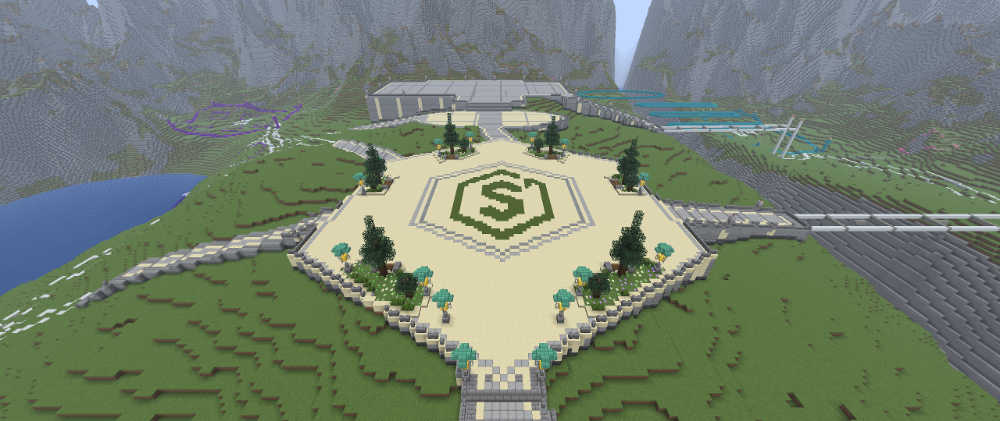
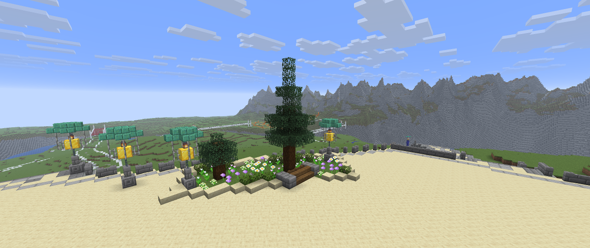
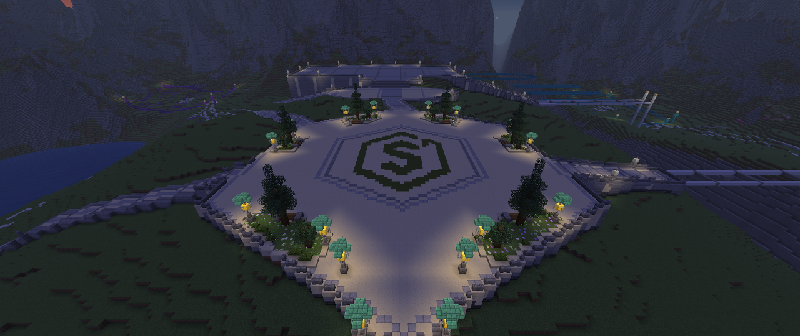
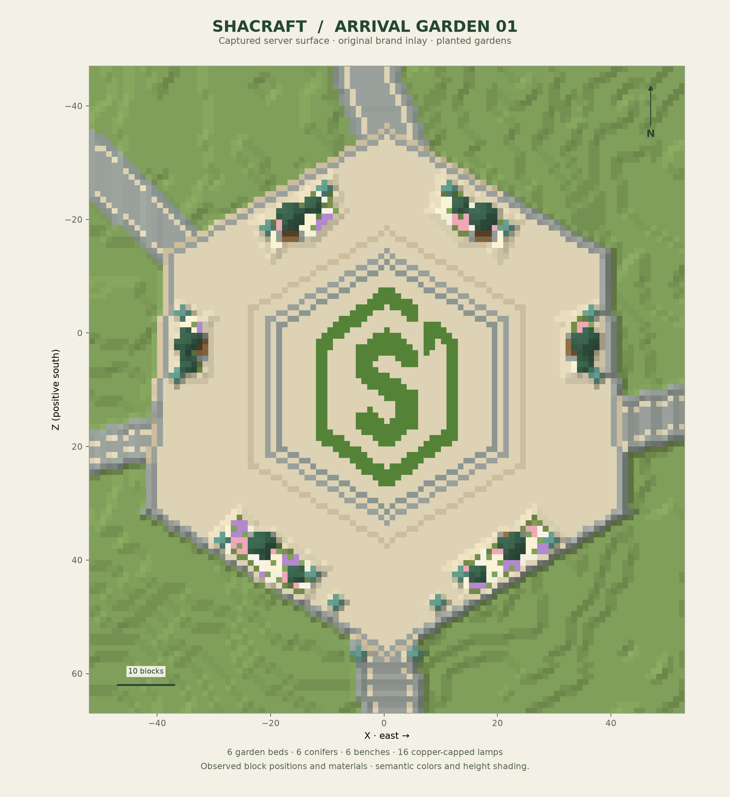

# Shacraft arrival square — garden finish

Stage 03 finishes **zone 01** on the existing foundations. The clock station and other districts keep their previous construction state.

The main reference is sheet 03, *Clock station and arrival square*, supported by sheets 01, 02, 10 and 11. Its defining features are a pale open apron, the green Shacraft emblem, concentric hexagonal paving bands, evergreen planting islands, pink and white flowers, benches and warm garden lighting. The concept images guide the composition; they are not measured Minecraft drawings.

## Built composition

- The former square setting-out grid is replaced with a cream paved field and three flush hexagonal contour bands.
- The actual green artwork from the preserved `logo-180.png` is sampled into a 25 × 35 block footprint. The open hexagonal shield and S replace the earlier placeholder medallion.
- Six low stone-edged planting islands contain six custom conifers, six smaller topiary trees, low evergreen clusters and 258 flowers. The southern beds extend to the balustrade, eliminating isolated strips of paving behind them.
- Six spruce benches face the square. Each has a three-block level approach through the planter edge. The benches are decorative; no sitting interaction is added.
- Sixteen supported lantern fixtures use slender posts and green copper hoods. Eight former light piers are replaced, including a balanced pair beside the arrival stair.
- Obsolete zone 01 survey stakes, its block number and its floating survey label are retired. Other district markings remain.

Paving remains at block Y95, with the main walking plane at Y96. The central sightline toward the clock station and all existing road connections are preserved. No terrain platform, station construction or new fountain is introduced by this stage.

## Checked construction

Before the work, the full server surface matched Stage 02 at all 589,824 columns. A fresh 359,964-voxel plaza survey included soil, foundations, fixtures and canopy air; 294,516 overlapping voxel states also matched the previous checkpoint. Unexpected manual edits stop the compiler, and the normal checked editor protects against changes between preparation and application.

The final candidate consists of 4,734 changed blocks. Its review checks persistent leaf distances, valid soil under flowers, grounded trunks, lantern support, bench approaches and 1.8 blocks of walking headroom. Grass beneath opaque tree trunks is replaced with dirt explicitly so random ticks do not change the recorded foundation state. The road audit starts with the previously verified usable surface, excludes actual planting and furniture, and checks the original eight route widths and their connectivity.

Final verification uses fresh observed blocks and a new full server map. These sequential surveys are not atomic world snapshots; construction remains idle during them. Perspective screenshots are real Fabric client captures, with heuristic render readiness. Geometry checks do not represent a human playtest or a full simulation of moving-player collisions.

The [final live report](references/shacraft-arrival-garden-verification.json) passed after **4,811 checked writes in 12 batches**, including a 77-block finishing pass that gives the conifers continuous green tips. All **4,734 final changed states** matched the latest observation. It checked 537 persistent leaf states, 258 supported flowers, 73 connected trunk blocks in 12 trees, 16 lantern supports and **4,955 clear walking samples**. All eight inherited road widths and 18 bench-front positions passed, with no isolated usable paving. The full **589,824-column map** matched the expected world, and all 41,467 visible water columns remained unchanged.

## Reusable tools

- `scripts/plaza-assets.py`: deterministic conifers, oriented benches and supported copper-hood lantern fixtures. Functions return local voxel states and never write to a world.
- `scripts/build-shacraft-plaza.py`: composes the approved garden geometry, real brand mask and static assets into a checked recipe. It preserves foundation elevations and existing road treads.
- `scripts/verify-plaza.py`: independent candidate/live validation of planting, fixtures, walking clearance and the inherited road network.
- `scripts/layout.py`: bounded checked placement, receipts and conflict-aware reverse undo.

The Paper policy now supports 99 materials. The added flowers are single-block decorative species; new copper forms are waxed. Existing restrictions on fluids, waterlogged states and nonpersistent leaves remain in force. The strict schematic codec retains its earlier material subset, so complete world checkpoints and voxel recipes are the preservation format for these gardens.

The final recipe, original observations and applied ledger are retained locally under `.runtime/plaza-stage03/`. The reference study and its earlier candidate are preserved separately from the finished state. Stage 02 remains available in the local Git archive and its full world backup.

The restorable final world checkpoint is `.runtime/projects/shacraft-arrival-garden-20260913/`, captured after an explicit save flush with automatic saving temporarily disabled and then re-enabled. It includes the full world container, matching plugin state, both stage ledgers and the earlier foundation receipts. Undo the apex polish ledger before the main garden ledger. The removed zone 01 text display is an independently recorded operator action rather than a block-journal change.
