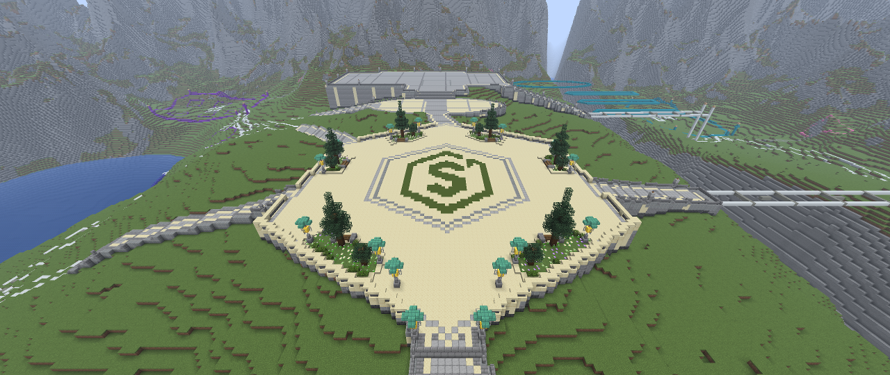
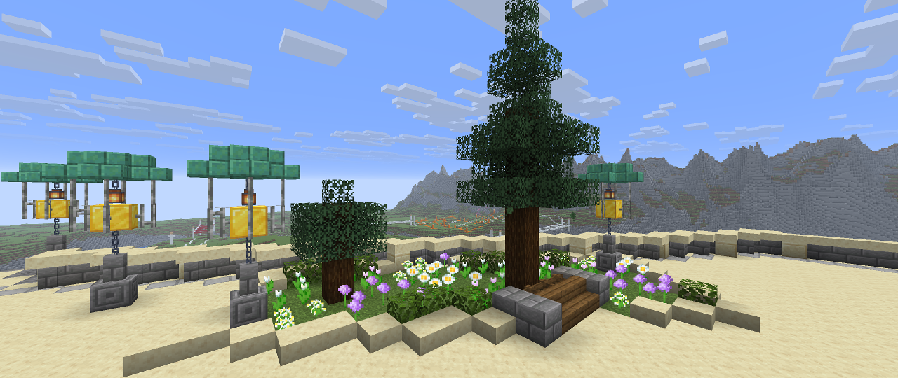
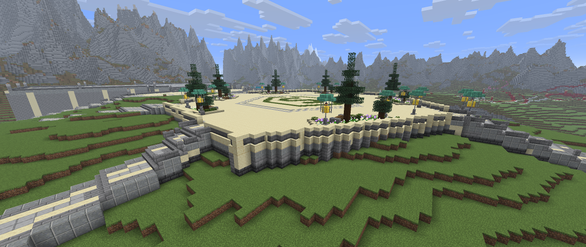
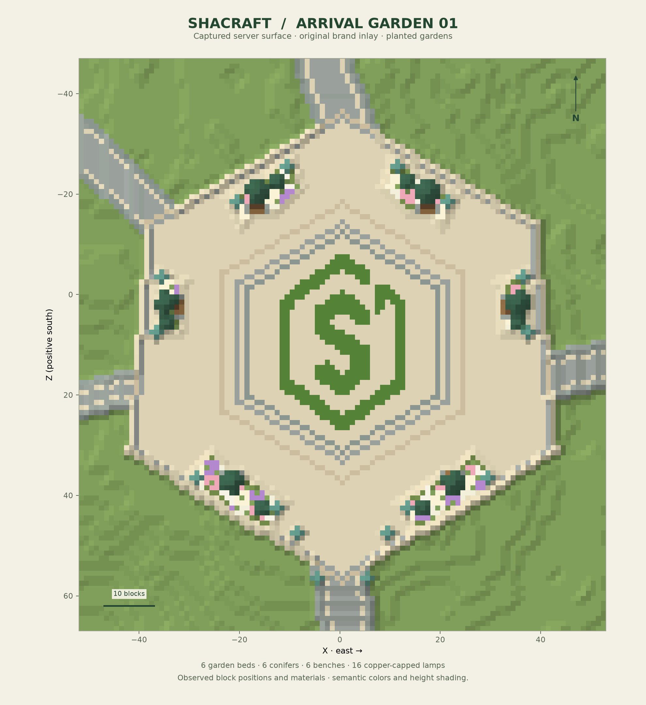

# Shacraft arrival square — perimeter balustrade

Stage 04 completes the edge of the finished zone 01 garden with a continuous pale handrail, regularly spaced sandstone piers and connected stone balusters. It follows the existing hexagonal terrace while keeping the road approaches open. The garden, logo apron, lighting and clock-station construction retain their previous state.

## Boundary and heights

The balustrade contains **302 perimeter columns** split into **five uninterrupted fence runs**, separated by the existing approach openings. The runs contain 46, 80, 74, 71 and 31 columns. Forty-six cut-sandstone piers mark endpoints, principal corners and intermediate bays.

Paving remains at block Y95, with its walking plane at Y96. Balusters and piers occupy Y96. A bottom smooth-sandstone slab at Y97 forms a continuous handrail with its upper surface at **Y97.5**, 1.5 blocks above the plaza walking plane. Wall connections are explicit, including tall side connections beneath the handrail and reciprocal connections to six adjoining road-rail columns.

The boundary forms a cardinal block chain. Elbows close the diagonal steps so adjacent railing pieces meet along block faces. Where planting occupies the inner choice, the connector moves to the outer side. Twenty-two small outer columns have stone-brick footings rising from observed full support to cut-sandstone coping at Y95. They support individual elbows without adding another terrace.

Four existing southern planter-rim slab columns are incorporated into the new boundary. Planting contents, existing lamps, road treads and the clear approach widths are preserved.

## Checked construction

`scripts/build-shacraft-balustrade.py` reads captured blocks and compiles a plan without changing the world. It refuses unexpected decoration at fence or handrail positions, protects inherited road cells, and finds observed footing support. `scripts/layout.py` checks expected states during preparation, journals bounded applications and verifies their results.

The editor made **692 checked writes in four batches**: 682 initial writes and ten finishing writes for the road-rail joints and buried soil. Twenty-one grass blocks beneath the new footings had already changed naturally to dirt; the remaining buried grass block was explicitly stabilized. The recorded final comparison covers **710 distinct expected states**, including those observed soil transitions. Their positions are preserved in `settled-soil.json` alongside the stage records.

The [final observed-world report](references/shacraft-balustrade-verification.json) passed. It checks the complete **556,308-voxel captured volume** against the baseline plus final plan, including **555,598 voxels outside the final changes**, with no mismatches. All 302 handrail columns, 46 piers, 22 grounded footings and six reciprocal rail joins passed. It also confirms all 1,172 preserved garden fixture states, **4,815 walking/headroom samples**, the original eight route widths and 32 bench-access columns.

The separate complete surface comparison matched all **589,824 map columns**, including 589,516 columns outside the edited area. All 41,467 previously visible water columns remained unchanged. The navigation graph reached all 57,352 surface samples across 14,338 usable columns.

These sequential voxel and surface captures are not atomic snapshots; construction was idle during final measurements. The volume check covers the supplied observed bounds. Route checks verify geometry, support and headroom, without simulating a moving player's complete collision body. Perspective images are actual Fabric client captures with heuristic render readiness.

## Tools and preservation

- `scripts/build-shacraft-balustrade.py` compiles the continuous perimeter, grounded elbows and explicit connections.
- `scripts/verify-balustrade.py` independently checks the final rail, protected garden, approaches, navigation and complete observed volume.
- `scripts/verify-foundation-survey.py` checks the full before/after server surface against the final column states.
- `scripts/layout.py` provides checked placement, journal receipts and conflict-aware reverse undo.

Stage inputs, captured observations, final recipes and application receipts remain under `.runtime/balustrade-stage04/`. The archive separates initial computed previews and candidate checks from final Minecraft images and fresh observed-world reports.

The restorable checkpoint is `.runtime/projects/shacraft-plaza-balustrade-20260913/`. It contains the complete world container, matching plugin state and stage receipts. The world was explicitly flushed with saving temporarily disabled for the copy, and automatic saving was re-enabled afterward. All 137 recorded world-file hashes passed verification.

Previous references and stages remain in `/home/emil/Desktop/Shacraft-Lobby-Archive`. Raw observations, complete world saves, private plugin configuration, authentication data and journals stay outside its Git history. Undo the finishing ledger before the initial balustrade ledger, then process older stages only if requested. Natural soil transitions are recorded explicitly and must be considered during restoration; manual-edit conflicts stop checked undo.
