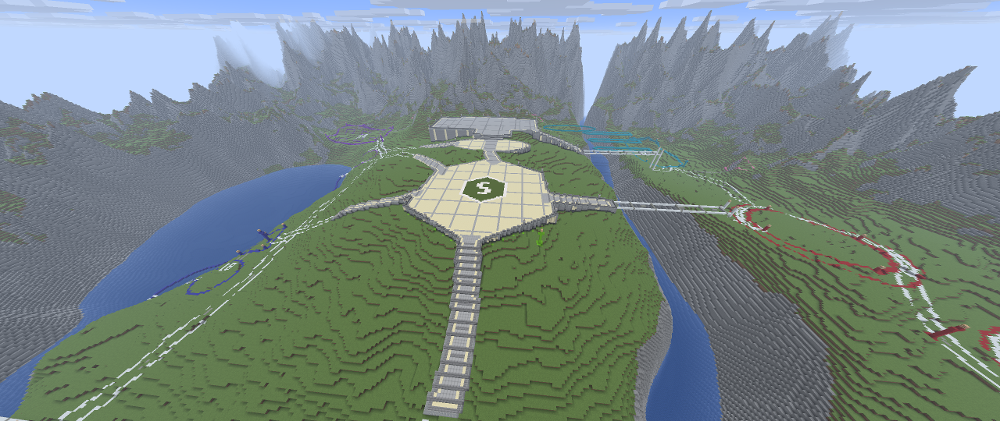
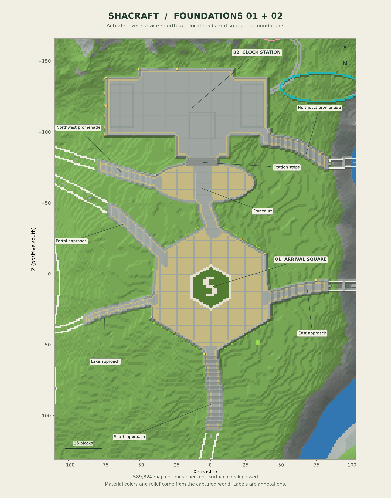
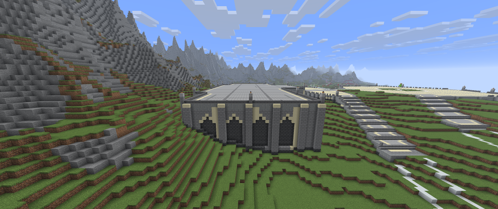
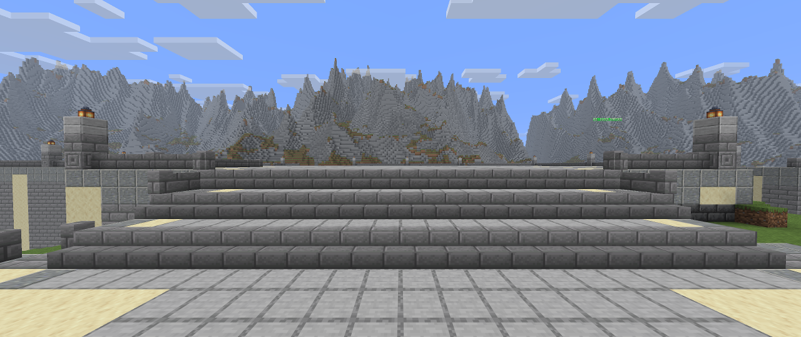

# Shacraft — foundations for zones 01 and 02

This document preserves the Stage 02 foundation checkpoint. Zone 01 has since received its [Stage 03 arrival garden finish](SHACRAFT-ARRIVAL-GARDEN.md).

This construction stage develops the arrival square and clock station in the approved natural v2 world. It also builds their local approaches. The other district reservations and future bridge spans remain at the survey stage.

## Levels and circulation

The arrival square and oval station forecourt use paving blocks at **Y95**, with the walking surface at Y96. The station floor uses blocks at **Y98**, with the walking surface at Y99. The station follows its actual hall, tower and pavilion footprint. Its western retaining wall has shallow blind arches and stone pilasters; solid backing remains behind the recesses.

A nine-block clear avenue links the square to the forecourt. A **21-block clear stair** rises to the station in half-block tread increments, with full landings. The local southern approach is nine blocks wide, the district connections seven, and the lake approach five. Curved roads use full transverse rows of correctly facing stairs, with separate edge coping. Lamps and balustrades sit outside the reserved clear lanes.

Finished road endpoints, expressed as X/Z and the supporting block's Y:

- Southern approach: `(1, 110)`, Y79, joining native ground at the same level.
- Portal approach: `(-72, -46)`, Y89, joining native ground at the same level.
- Lake approach: `(-90, 32)`, an east-facing bottom stair at Y84, stepping down to native full blocks at Y83.
- Northwest station approach: `(-80, -77)`, Y85, joining native ground at the same level.
- Eastern bridge approach: `(82, 8)`, Y87.
- Northeast bridge approach: `(82, -78)`, Y86.

The two bridge approaches end at temporary balustrades beyond the completed walking deck. Those barriers must be removed when the corresponding bridge spans are constructed. Beyond the other local endpoints, the remaining route markings reserve later work; they are not finished roads.

## Materials and construction

The plaza has pale sandstone paving, restrained stone courses and a flush green Shacraft medallion. The station has a stone structural floor with setting-out bands for the future hall, clock tower and end pavilions. Exposed bases combine deepslate, stone brick and andesite coping. Twenty-seven lantern piers light the edges.

Every deck has structural courses and solid support down to the observed original terrain. The generator does not create a new rectangular terrain platform outside the building footprint. Small local cuts clear the paving and headroom; the original mountains and watercourses remain outside this construction scope.

## Checked workflow

The design was compiled against a **1,981,407-voxel live before-survey**, including underground support and headroom. Unexpected differences from the original terrain plus known survey markers stop compilation. The placement driver also checks the caller's expected states atomically during preparation, journals bounded operations and verifies each applied batch.

The stage inputs and receipts are retained locally under `.runtime/foundations-stage02/`. A fresh post-build voxel survey checks standing heights and 1.8 blocks of vertical clearance on the actual full blocks and both stair treads. An independent half-block navigation graph checks route connectivity and full-width cross sections. These are geometric and block-state checks, not a simulated moving player or a manual playtest.

The full server-derived before/after surface maps are compared across the 768 × 768 world. The verifier applies air edits before finding the new top block, so lowered surfaces are checked correctly. Surface maps and sequential voxel surveys are not atomic; construction is kept idle while final measurements are taken. Perspective images use the real Fabric client, whose render readiness remains heuristic.

The [completed verification report](references/shacraft-foundations-verification.json) records **79,081 checked writes across 67 journalled batches**, including a 408-block refinement that moved the western pilasters clear of the arches and darkened their intact backing. All **78,673 final changed voxel states** matched the post-build survey; **15,708 standing-height and headroom samples** passed. All **589,824 surface columns** matched the expected result, including **572,923 columns outside the edited area**. All 41,467 previously visible water columns remained unchanged, and no observed water blocks were replaced.

## Tools and preservation

- `scripts/foundation-study/design.py` and `geometry.py` define the elevations, contours, stairs and road corridors.
- `scripts/build-shacraft-foundations.py` compiles observed terrain, approved geometry and materials into a checked block plan; it does not write to the world.
- `scripts/layout.py` applies bounded batches and supports checked reverse undo through the stage ledger.
- `scripts/foundation-survey.py` records actual voxel states and checks floor support and headroom.
- `scripts/foundation-study/verify_geometry.py` independently checks planned navigation.
- `scripts/verify-foundation-survey.py` compares actual surface maps with the complete edited column state, including excavation.

Original references and the marked-site checkpoint are preserved in the separate local Git repository `/home/emil/Desktop/Shacraft-Lobby-Archive`. Each completed stage has its own directory, source provenance and SHA-256 manifest. Restorable world backups remain outside Git, together with their matching private plugin state and operation journals.

The completed world checkpoint is `.runtime/projects/shacraft-foundations-01-02-20260913/`, captured with saving disabled after an explicit flush; normal saving was then re-enabled. It contains the full world container, including `world/dimensions/minecraft/shacraft_lobby_v2`, both relevant plugins and the construction ledgers. World-file checksums are recorded in `checkpoint.json`.

An undo must run newer stage ledgers before older ones and stop on manual-edit conflicts. Floating labels are separately managed entities; their operator commands are recorded with the stage artifacts rather than in the block journal.
