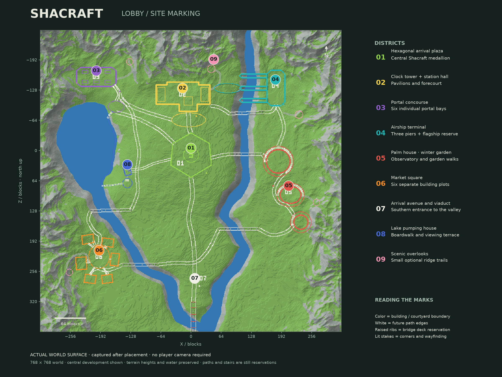
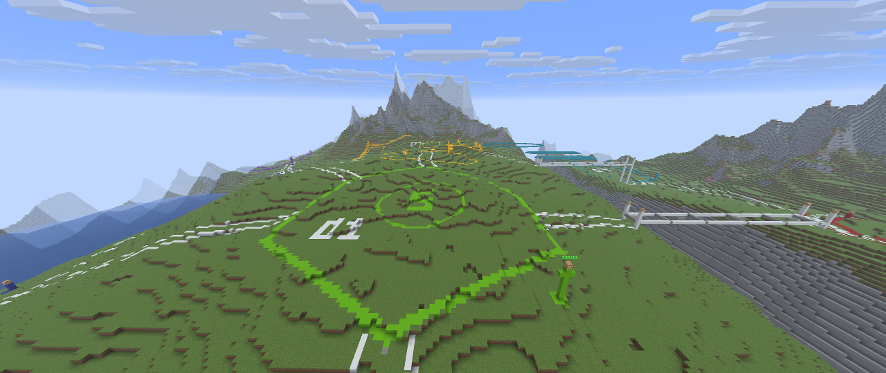

# Shacraft lobby site marking

This document preserves the **Stage 01 survey checkpoint**. The current world has progressed to [Stage 02: foundations and local roads for zones 01 and 02](SHACRAFT-FOUNDATIONS.md).

The existing `shacraft_lobby_v2` alpine terrain is now marked for the future lobby. This is a site survey: building contours, entrances, courtyards, paths, bridge deck reservations, height stakes and wayfinding. Buildings, playable minigames and finished paths have not been constructed.



## Visit

Connect to the private local server at `127.0.0.1:25575` using the **26.2 MCP Building** Prism profile, then use `/lobby`. Spectator mode is useful for inspecting the complete arrangement. The configured camera client can reconnect autonomously after a local server restart.

The planning envelope is 768 × 768 blocks. Natural mountains frame the developed valley; the terrain was not flattened to fit district rectangles. Surface contours replace a single observed top block. Raised lines reserve future bridge, pier and airship elevations while leaving the river below intact.

## Legend and coordinates

Coordinates below identify the districts in X/Z. The same two-digit numbers are drawn with blocks; lit colored posts carry nearby floating names.

- **01 · lime · arrival square · (0, 8).** Open hexagonal plaza and Shacraft medallion, with a direct view toward the clock station.
- **02 · yellow · clock station · (-18, -119).** Hall, projecting tower, end pavilions and a smaller oval forecourt.
- **03 · purple · portal concourse · (-201, -156).** Chamfered hall, six separate portal bays and a garden approach.
- **04 · cyan · airship harbor · (179, -137).** Terminal, three west-facing piers at Y79 and a flagship reservation at Y92.
- **05 · red · sky gardens · (207, 88).** Palm glasshouse, winter garden and observatory. White paths follow their surrounding courts.
- **06 · orange · market quarter · (-195, 225).** Six small building plots, an open market square and individual entrance connections. These plots use the calmer southern shoulder.
- **07 · white · arrival avenue · (8, 284).** Long southern approach and a final viaduct at Y65.
- **08 · blue · lake waterworks · (-135, 43).** Pumping house, viewing terrace, Y51 boardwalk and two marked future stair approaches.
- **09 · pink · scenic overlooks.** Five small viewpoints with optional trails, preserving the mountain slopes.

White paired lines reserve path edges. Main avenues are designed for nine-block clear corridors, the district loop generally seven, and smaller access paths three to five. Colored building boundaries are reservations, not final material choices. White cross-ties and tall end stakes show bridge deck widths and elevations. Labels identify the larger level changes where stairs or staged access will be needed. The current block contours alone do not certify walking access.

## What was placed and checked

- 41 geometric reservations and 48 route segments, including six bridges, three airship piers, six portal bays and six market buildings.
- 16,967 distinct marker positions, applied with 17,040 checked writes across 36 journalled batches. The small second pass adds missing access links and extends bridge height stakes.
- Eight district labels and eleven access/elevation labels, verified again after the server restarted.
- Every batch was checked before planning, atomically against its caller snapshot during preparation, and after application. Stable operation keys and persisted receipts support resumption and checked undo.
- Full before/after world surface comparison and targeted reads beneath obscuring markers are recorded in the [verification report](references/shacraft-layout-verification.json). The map is read from actual Paper blocks, not reconstructed from the noise generator.



## Autonomous map exporter

The optional terrain plugin implements this **server-console** command:

```text
lobby map survey-name
lobby status
```

It writes `plugins/ShacraftTerrain/maps/survey-name.png` and `.json`. The PNG has one pixel per world column, north up, with material colors and height shading. The JSON includes actual surface heights, material palette and coordinates. Existing names are never overwritten. The exporter loads only existing chunks, reads one chunk per tick, and renders/writes the detached result asynchronously. It requires no Minecraft client or account.

The exporter reads chunks sequentially, so a map is not an atomic world snapshot. Construction was idle during the verification captures. A top surface also hides the water beneath a bridge; separate bounded RPC reads verified that water. Text display entities appear in game but are not included in this block-surface map.

This is an orthographic world map. Perspective screenshots still use the Fabric spectator client and its heuristic render readiness.

## Reproduce and revise

The reusable [spatial plan](../examples/layout/shacraft-lobby-layout.json) and [access refinement](../examples/layout/shacraft-access.json) describe reservations, routes, heights and intent. Their geometry was studied against the natural terrain before live surface data was used for placement.

- `scripts/mark-shacraft-layout.py` compiles the primary survey from a current surface map and authorized world scope.
- `scripts/compile-layout-access.py` compiles the access refinements against the original survey and known primary marker states.
- `scripts/layout.py report` describes bounded batches without touching a server. `prepare` checks the input without allocating expiring plans. `apply --execute` writes and verifies; `undo --execute` uses reverse journalled undo.
- `scripts/render-layout-map.py` renders the labelled atlas from live surface data. Supplying `--blocks` explicitly produces a labelled **design preview** instead.
- `scripts/verify-layout-survey.py` compares every visible column and checks hidden water through bounded live reads.

The local applied ledgers are `.runtime/layout-study/placement-final.json` and `.runtime/layout-study/access-ledger.json`, with adjacent immutable input snapshots. Undo the access ledger before the primary ledger. Manual changes can block undo and must be preserved and reviewed. The 19 text displays are a separate operator-managed layer with tag `shacraft_layout_v1`; they are not part of the block journal. An explicit undo of the whole survey also requires removing that tagged display layer in the same world.

A complete stopped-world backup, including plugin state and layout ledgers, is stored locally in `.runtime/projects/shacraft-marked-lobby-20260913/`. The earlier unmarked natural world remains backed up separately. Private configuration and authentication material are excluded from the public examples and report.
