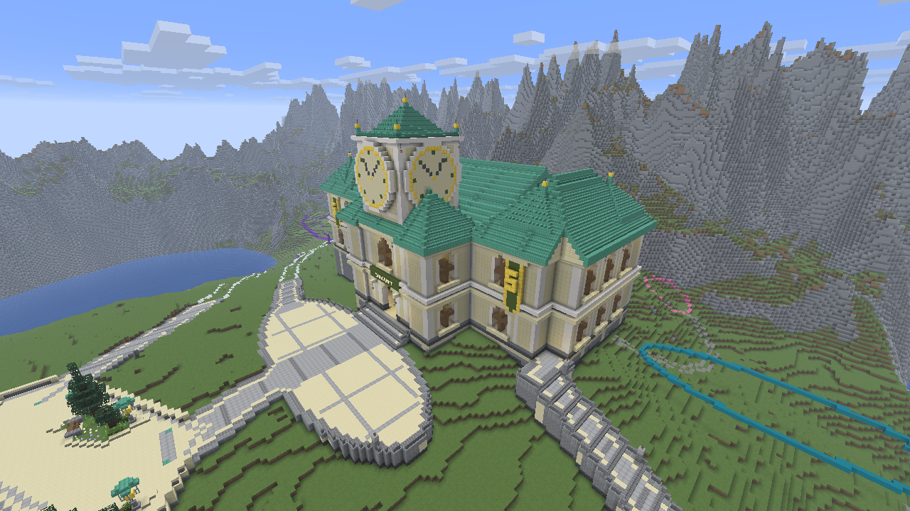
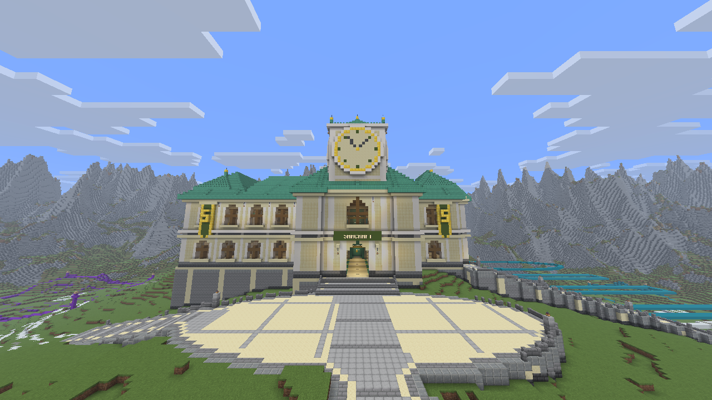
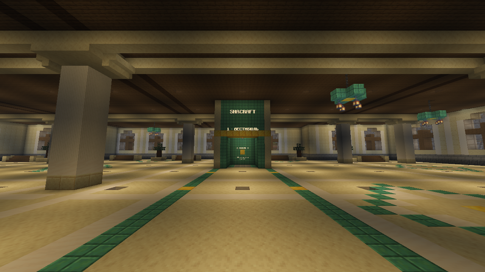
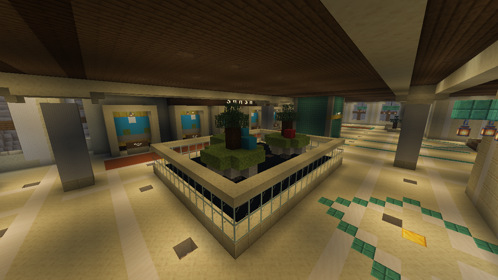

# Shacraft clock station — vestibule and SMASH gallery

The clock station is built, furnished and verified in the local lobby world. Its two public floors contain the arrival vestibule and SMASH selection gallery, with enclosed personal lift cabins, warm architectural lighting and a closed island display. The complete world and matching plugin state are backed up.

The station occupies the existing irregular zone 02 foundation. Its 5,764 surveyed columns fit inside X **-74..40**, Z **-145..-83**. Pale stone arcades, green copper roofs, spruce ceilings, brass accents and warm lanterns continue the original clock-station reference. The roof silhouette rises from eaves at Y126 to a main ridge at Y140 and a clock-tower peak at Y158. Roof overhangs extend the complete building envelope to X **-76..42**, Z **-147..-81**.

The coordinate drawings and generated perspectives remain in `docs/references/zone02-interior-v1/`. Those images establish the visual direction; the saved layout and actual foundation geometry govern placement. They are not photographs of the completed building.

## Two complete public floors

The vestibule floor occupies block Y98, with players standing at **Y99**. The SMASH floor occupies block Y112, with players standing at **Y113**. The intermediate deck at Y111..112 is continuous. Decorative coffer ceilings close each room; the upper structural ceiling at Y124..125 separates both public floors from the inaccessible roof and clock tower.

The south entrance follows the existing X=-6 approach axis. Its clear opening spans X=-9..-3, retaining seven blocks of width. Matching square columns align vertically on both floors. Shallow cream corbels and spruce ceiling panels remain above the circulation space, while inset green and brass-colored floor bands guide the central approach. Side galleries contain spruce benches, small planted stone boxes and restrained floor mosaics. There are no additional unfinished public rooms, stairs to the attic or open shafts.

The interior generator owns only the two-block setback inside the actual foundation, at block Y98..123. It leaves the exterior wall and window layers to the exterior compiler. Its 5,064 interior columns contain fifteen benches, ten small topiary planters and 48 hanging lanterns, with three additional miniature trees in the diorama. The complete recipe combines the exterior and interior before selecting only changed states against the captured baseline.

Real Minecraft photographs prompted a lighting refinement. Sparse brown-glass floor tiles reveal concealed glowstone below the paving; matching small lenses recess into the plain spruce ceiling panels. The regular nine-block layout adjusts locally around beams, mosaics, furniture, controls and landing points. All lens and emitter replacements retain full-block collision and solid floor/ceiling separation. The enclosed diorama receives its own concealed lighting.

## Enclosed lift cabins

The lift housing is **X=-10..-2, Z=-124..-116** on both floors. Each stationary cabin has a five-by-five clear interior at X=-8..-4, Z=-122..-118 and a five-block-wide south opening. Both cabin floors remain solid. The space above each cabin is closed, so the lift provides no passage to a shaft or unfinished upper rooms.

Gold selector blocks sit on the north interior wall at **(-6, 101, -123)** and **(-6, 115, -123)**. Right-clicking a selector from inside the matching cabin changes floors for that player alone, arriving at **(-5.5, 113, -119.5)** or **(-5.5, 99, -119.5)** facing south. The listener checks the destination support and two air blocks before teleporting. The independent geometry audit checks four blocks of headroom.

`/station` enters the ground-floor vestibule. `/station 1` and `/station 2` select the two completed cabin stops. The commands were exercised on the local server and both resulting player positions were read back; a third stop was rejected. The physical mouse-click path is covered by listener and cabin-selection tests but was not exercised through an automated client click.

Zone 01's previous invisible boundary remains in place. Use the station entry command while that earlier garden enclosure is retained; opening the physical route is a separate checked edit.

Twenty-four persistent text displays provide the exterior name, lift instructions, floor names, numbered arena placeholders and rules panels. A repeated installation replaced the previous set without increasing the count. These separately managed entities are recorded outside the block recipe. Arena placeholders do not perform world transfers or matchmaking.

## SMASH gallery

Six seven-by-five selection alcoves line the north gallery at Z=-140..-136, with centres at X **-42, -32, -22, -12, -2 and 8**. A seven-block-deep clear aisle at Z=-135..-129 connects them. Each alcove has a small decorative island relief, a framed display and a reachable selection surface. Slots **01–06 remain unassigned**; they do not advertise invented arena worlds, live queues or active minigames.

The western display occupies **X=-42..-24, Z=-124..-110**, a 19-by-15 rectangle. Miniature planted islands stand above a solid illuminated base, enclosed by continuous pale stone and glass. Twelve full brown-glass floor lenses admit concealed light inside the display while maintaining its intact base. It is a closed display on an intact floor, with no playable void below it. The nearby west gallery explains damage, knockback and double jumping. The eastern wing provides waiting benches and an orange terracotta floor accent. No SMASH arenas are included in this construction stage.

## Verification and preservation

The completed stage required **84,446 checked writes across 98 batches** and has **83,924 final distinct changed states**. The final observed world matched every planned state. All **572,326 observed voxels outside the edits** also matched the baseline, completing the check of the full 656,250-voxel survey.

Independent observed-block checks pass for **4,796 vestibule walking columns** and **4,176 SMASH walking columns**, each with four blocks of clear headroom, and all **107 named furnishing and lift approaches**. Those counts include the exterior doorway columns; the interior generator alone reports 4,775 vestibule columns. Both cabins, both lift doorways, the main approach and the complete selection aisle were checked voxel by voxel. The fixture audit passed for 72 planned lantern supports, 78 persistent leaf states and thirteen rooted station/display trees.

The enclosure audit uses a temporary virtual cap at the intentional south entrance, then floods from both public floors and lift cabins. The cap is an analysis boundary, not a block placed across the doorway. Full glass and known full cubes stop the flood; partial and unknown shapes are treated as passable. The observed building has no connection from either furnished floor to the attic or clock tower. This static geometry audit does not prove lift behavior, spectator restrictions or administrative access control.

The complete visible-surface comparison passed for all **589,824 map columns**: 6,496 changed station columns and 583,328 unchanged outside columns. All **41,467 previously visible water columns** were preserved. The map was captured before the last lighting and nameplate polish. A separate final voxel comparison confirmed that all 602 subsequent polish differences lie below the exported roof surfaces, and that the actual final top blocks and surveyed blocks above them match the map for every station column.

The final plugin build passed 97 Maven tests; seven station-verifier tests and ten foundation tests also passed. World and surface captures are sequential rather than atomic. The four final photographs are actual Minecraft client captures with heuristic render readiness; their metadata does not claim a verified server revision. Observed block checks and runtime interaction receipts provide the separate measurement evidence.

`scripts/station-exterior.py` and `scripts/station-interior.py` generate the geometry. `scripts/build-shacraft-station.py` combines their owned regions, checks the observed baseline against the prior foundation checkpoint and compiles expected-state edits. `scripts/light-shacraft-station.py` generates the concealed lighting grid against the observed built station. `scripts/verify-station.py` independently checks the resulting circulation, enclosure and captured volume. Stage records are kept under `.runtime/station-stage07/`.

One interrupted batch verification exposed Minecraft's explicit `deepslate[axis=y]` state. The original receipt and manifest were retained. A fresh partial survey confirmed the applied prefix, and a separate remaining recipe continued from that observed state. This was a state-serialization correction at three miniature island tips; the retained recovery report records the exact positions and hashes.

The authoritative final recipe and metadata are `.runtime/station-stage07/final-v2/station.json` and `station.metadata.json`. The final observation is `after-complete.json.gz`, with `actual-complete-qa.json`, `complete-surface-verification.json`, `complete-surface-invariance.json` and `runtime-verification.json` recording the checks. The owner was returned to the vestibule at **(-5.5, 99, -92.5)** with spectator mode preserved.

The restorable backup is `.runtime/projects/shacraft-station-complete-20260913/`: **650 world and plugin files, 237,341,328 bytes**, with every recorded SHA-256 hash verified. Saving was flushed and temporarily disabled during copying, then automatic saving was re-enabled at 15:42:17 local time. `backup-receipt.json` records its location and verification.

The local Git archive preserves the final documents, generator and verifier snapshots, compact reports, reference plans, Minecraft photographs and surface maps. Complete world saves, raw voxel observations, private configuration, authentication, plugin binaries and placement journals remain in the separate local runtime backup. Earlier reference and construction checkpoints remain unchanged.
