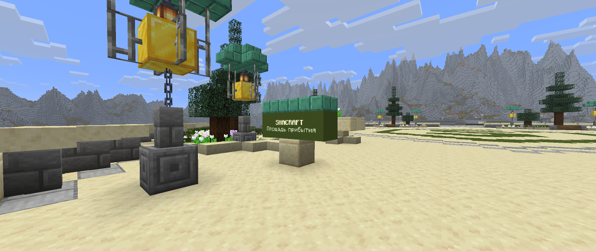
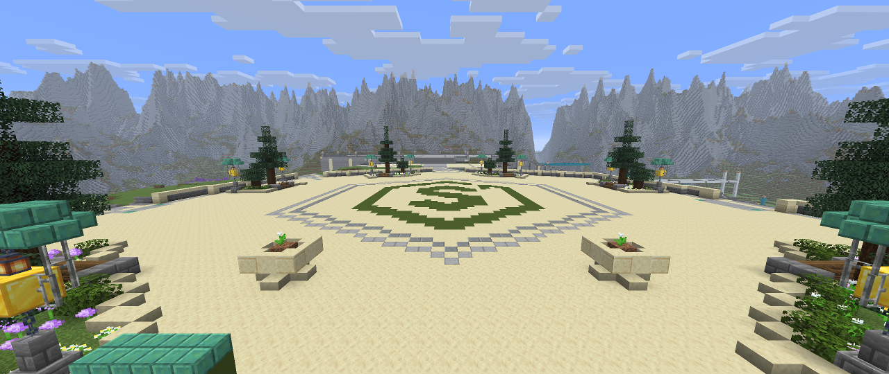
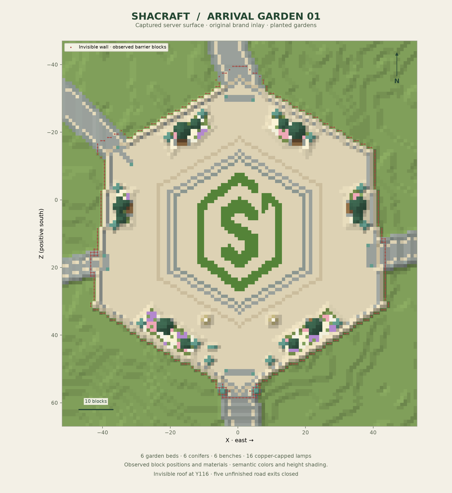

# Shacraft zone 01 — finishing details and invisible boundary

The arrival square is finished and its five approaches are closed with an invisible collision boundary. Players can explore the completed garden while the station and other districts remain outside the current playable area. The existing emblem, six planting islands, benches, lights and broad central sightline remain the focus.

## Visible finish

Two low pale-stone urns with white flowers stand at X/Z **(-10, 35)** and **(10, 35)**. A low green nameboard at **(-8, 43)** carries `SHACRAFT` and `Площадь прибытия`. Its text is a separately managed display entity attached visually to the board, with no directional arrows toward closed roads.

Five flush threshold bands use stone with small green-copper insets at the north, south, east, west and northwest approaches. Paving remains at block Y95, with the walking plane at Y96. Three full sandstone joint piers complete the road-to-plaza boundary, bringing the perimeter pier count to 49.

The visible recipe contains 106 changed block states, followed by a sixteen-write urn refinement. Together with the enclosure, the editor made **11,518 checked writes in twenty batches**. All **11,502 final distinct changed states** matched the final observed world.

## Invisible enclosure

The boundary uses **11,396 barrier blocks**, recorded in a separate placement ledger so the enclosure can later be removed while keeping the garden finish. It includes side walls and a roof at block **Y116**, above the existing trees. The full-block floor at Y95 contributes to the enclosure.

The compiler bends the boundary inward around existing partial-block stairs and rails instead of replacing those details. The intended interior excludes 87 boundary-adjacent voxels for these local folds. The independently derived collision membrane contains **17,276 full-cube positions**: 11,396 barriers and 5,880 existing or finished structural blocks.

The [final observed containment report](references/shacraft-zone01-containment-verification.json) passed. The intended interior volume has one connected component containing 117,673 voxels. No interior voxel was reached from an exterior flood, and all **5,748 swept player-box boundary probes** were blocked. The probes use a 0.6 × 1.8 block player body; the complete static containment criterion is the full independently derived membrane. Unknown and partial blocks are conservatively treated as empty during the exterior flood.

This guarantee concerns normal continuous collision-based movement. Spectator mode, block removal, operator commands, plugin teleports and arbitrary discontinuous teleport or pearl behavior are outside its scope. The boundary is not an administrative access-control system.

## Arrival, respawn and maps

The configured `/lobby` destination is **(0.5, 96, 43.5)**, inside the southern welcome area. A scoped death-respawn handler returns players who died in the lobby world to that configured point, preventing Minecraft's highest-surface search from placing them on the invisible roof. It leaves other worlds and non-death transitions alone. The lobby spawn radius is zero. The scoped event behavior was unit tested; no player was killed for verification.

The owner was returned to creative mode at the verified arrival point after inspection. The nameboard entity, spawn settings and owner return are recorded separately from the block journals in `operator-actions.json`.

The server map exporter explicitly ignores `minecraft:barrier`, alongside air, when finding each visible surface. Exported metadata declares this policy, so maps show the garden beneath its invisible roof. Collision verification reads actual blocks separately and includes barriers.

## Final verification and preservation

The complete **622,098-voxel captured volume** matched the baseline plus final plan, including **610,596 voxels outside the edits**. The finishing audit passed for 537 persistent leaves, 260 supported flowers, sixteen lanterns, twelve rooted trees, **4,794 walking/headroom samples** and 32 bench-access columns.

The complete visible-surface comparison matched all **589,824 map columns**. It covered 6,164 affected columns, with 87 visible surface changes; all 583,660 columns outside the affected area matched their baseline. All 41,467 previously visible water columns remained unchanged. The distinction between actual collision blocks and the declared visible-surface policy is preserved in the separate reports.

These sequential captures are not atomic snapshots. The full-volume statement applies to the supplied observed bounds, and static geometric checks are not a human playtest. Perspective images are actual Minecraft client captures with heuristic render readiness.

`scripts/finish-shacraft-zone01.py` compiles the visible finish, enclosure and boundary metadata. `scripts/verify-zone-containment.py` independently derives the collision membrane, checks containment and protects existing decoration. Stage records remain under `.runtime/zone01-stage05/`.

The barrier ledger is separate from the finishing and urn-polish ledgers. Remove barriers through their checked ledger when reopening the other districts; the visible garden finish can remain. Undo the urn polish before undoing the earlier visible finish. The nameboard text and scoped spawn settings are separately recorded operator/configuration actions.

The restorable backup is `.runtime/projects/shacraft-zone01-complete-20260913/`. The complete world container and matching plugin/receipt state were copied with saving temporarily disabled after an explicit flush, then automatic saving was re-enabled. All 137 recorded world-file hashes passed verification.

The local Git archive preserves compact design and final reports, source snapshots, maps, photographs and the world-backup location. Raw voxel observations, complete world saves, private configuration, authentication, plugin binaries and journals remain outside Git. All previous references and construction checkpoints remain unchanged.
