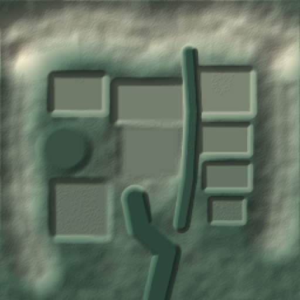

# Terraforming tools

The terrain toolkit turns one small JSON recipe into a repeatable height field, a raster preview, and bounded edit plans. It prepares the terrain foundation for the Shacraft lobby: mountain ridges, cliff-backed building platforms, a lake bed, garden terraces and ravines. Buildings and fluids are separate work.

## Design and boundaries

A recipe describes an **absolute target surface**, not a brush that reads and smooths the existing world. Features operate in the listed order on `base_height` plus seeded three-octave value noise. World coordinates determine the noise and surface layers; neither tile boundaries nor a cropped envelope change their phase. The write envelope is inclusive and clips writes, not the underlying field.

Implemented features:

- `hill`: adds `height` inside a circular core, with a smooth outer falloff. A negative height makes a depression.
- `ridge`: adds `height` along a polyline. `width` is the core half-width; repeated points are allowed.
- `plateau`: blends to absolute `height` inside a rectangular footprint and outward through `falloff`. Place these after noise/hills to obtain level building pads.
- `basin`: only lowers the surface to absolute `height` inside a circular core and banks. It never raises a low area.
- `channel`: only lowers to absolute `height` along a polyline, with a flat bed and smooth banks.
- `terrace`: blends toward elevations rounded down to multiples of `step`; `strength` is 0..1. This affects the whole field at that step in the recipe, so subsequent plateaus can restore exact platform heights.

`radius` and `width` describe a flat core radius/half-width in blocks. `falloff` is the additional outside transition distance; all distances are positive. A small core with a large falloff produces a rounded hill. Polyline paths may have 2–32 points. Heights can be negative. All feature heights are absolute except the additive hill/ridge heights.

Modes:

- `sculpt`: terrain material below the target surface, air above it, within the envelope.
- `fill`: targets only cells at/below the target surface. It can replace natural material there, but does not clear above it.
- `cut`: targets only air above the target surface. It does not add terrain or repaint the remaining surface.

The palette contains `rock`, `soil`, `surface`, and `soil_depth` (0–16). The top block uses `surface`, the next `soil_depth` blocks use `soil`, and deeper cells use `rock`. Layering follows the global surface even when it is outside a particular vertical tile. No new topsoil is invented at a tile boundary.

Supported natural materials: stone, andesite, granite, diorite, deepslate, cobbled deepslate, dirt, grass block, moss block, sandstone and terracotta. Cave/void air can also be replaced. Bedrock, water, lava, trees, buildings made of other materials, and block entities are rejected. **Natural-material buildings cannot be distinguished from terrain by material alone.** Exclude existing work with inclusive 3D `preserve` boxes and use the existing part protection system. A preserve mask omits writes; it does not infer or protect the structural supports beneath a build. Include its foundations and a suitable margin.

This first implementation is a 2.5D height field. It does not create caves, overhangs, imported heightmaps, vegetation, biomes, automatic erosion or fluid flow. Lake beds and ravines are dry. Neighbor/environment checks still apply. Terraforming does not weaken the normal write or undo policy.

## MCP workflow

1. Call `project_context` and inspect the intended site. Select a dedicated area before writing.
2. Call `terrain_preview` with `recipe` and optional `resolution` (32–256, default 128). It does not read or alter world blocks. The native PNG shows the target field; it is not a Minecraft screenshot or a before/after comparison. North (-Z) is up. Pink marks a preserved cell at the sampled surface. Narrow/subsurface masks may not appear in the sampled image.
3. Keep the returned `terrain_id`, `tile_count`, and `tile_budget`. Save the recipe locally. The ID is a SHA-256 of the recipe with sorted object keys; feature order remains significant. The plugin caches up to 32 recipes until restart. Regenerate a preview from the same JSON after eviction/restart.
4. Call `terrain_prepare(terrain_id, tile_index)`. Indices start at zero. Tiles advance X first, then Z, then Y, from the envelope minimum. At the normal 4096-block budget, tiles are at most 16×16×16. A smaller configured budget changes their edge and numbering; never resume a batch under a different budget.
5. Review `tile_bounds` and `changed_blocks`. `status: empty` means there are no changed targets, either because of the mask/mode or because the sampled targets already match. No plan is journaled for these tiles. Otherwise use the returned `plan_id` and `plan_hash` with `build_apply` and a stable unique `idempotency_key`.
6. Poll `operation_status` to completion. Stop on conflict, cancelled, failed or recovery-required status. Do not prepare a replacement to force a conflicting tile through.
7. Undo with `operation_undo_prepare` and normal checked apply. For a batch, reverse the operation order. Cancellation/failure can leave partial edits; tiles are not one atomic transaction.

Recipes are bounded to 64 features, 64 preserve boxes, 2048 blocks per horizontal side, 1,048,576 columns, 384 blocks vertically, and 134,217,728 voxels in the envelope. Preview statistics are sampled, not exhaustive extrema. `clipped_samples` reports surfaces outside the vertical write envelope; such surfaces need a wider envelope or deliberate clipping.

The terrain compiler and preview renderer run outside the server tick. Live reads, natural-material checks, area checks, protected parts and plan snapshots run through Paper's main thread. Writes use the existing sliced, durable intent/receipt journal. Manual modifications after preparation are checked again on application; existing undo ownership rules remain in force. Only already-loaded chunks may be edited; this toolkit does not silently generate or force-load a whole map.

## Local tools and examples

Build once with `./mvnw package` and `npm --prefix bridge test`. Offline preview needs the Java runtime installed by the project's bootstrap script; `MCB_JAVA_HOME` can override its path.

Render the proposed Shacraft terrain without a running server:

```bash
python3 scripts/terrain.py preview examples/terrain/shacraft-massif.json \
  --output docs/references/shacraft-terrain-heightmap.png
```



The example proposes a 768×768×192 envelope and therefore 27,648 possible tiles at 4096 blocks each. This is a layout experiment, not an instruction to apply all tiles to the current world. It must be assigned a new, suitable project area before use. The current Gothic hall site is not a valid destination for it.

For an authorized small site, a local batch avoids sending every tile's polling traffic through model context. This Linux runner uses an exclusive manifest lock, saves requests before sending them, stops on conflicts and processes at most 64 explicitly selected tiles per invocation:

```bash
python3 scripts/terrain.py apply examples/terrain/small-hill.json \
  --start 0 --count 1 --manifest .runtime/my-terrain-batch.json --execute

# Resume the exact same command and manifest after a transport interruption.
# Do not delete or edit a manifest to bypass a conflict.

python3 scripts/terrain.py undo --manifest .runtime/my-terrain-batch.json --execute
```

The small example requires a loaded, authorized all-air test area at x/z 0..7, y 80..87. It is not automatically applied. The default backend configuration belongs to the local development server; `--config` selects another local plugin config. `--console` is only for an isolated server explicitly configured with `allow-local-automation: true`. Credentials never enter the manifest or printed results.

A manifest binds the recipe, project, world, epoch, tile budget, range, immutable plans, stable keys, operation IDs and undo progress. Lost apply responses are resolved by resuming the original apply with its saved key. Undo refuses to start an unconfirmed apply merely to discover whether it ran. Expired plans and recovery-required operations require inspection; the runner does not regenerate or force them automatically. An interrupted undo resumes from its recorded reverse plans. Once undo has started, the manifest cannot be reused for new construction.

## Verification and current scale limit

Automated tests cover ordered features, negative elevations/coordinates, deterministic noise, horizontal and vertical tiling, layer continuity, preserve masks, input/resource rejection, PNG metadata, real journal apply/undo/conflicts, native MCP transport and validation, and persistence before a potentially lost apply response.

The opt-in `bridge/test/live-terrain.mjs` exercises the real MCP → Paper path in an isolated fixture: preview without writes, a 201-block hill, idempotent replay, checked undo, protected existing gold block, preserved cell, stale-plan conflict, empty mask, area rejection and unknown recipe ID. The local batch runner is also tested by apply → resume → undo with full air restoration.

A compact recipe and native PNG reduce context cost; they do not eliminate server work. Large sites still need many live reads and potentially large journals. No full 768×768 application, throughput target or crash/disk benchmark has been completed. This toolkit is ready for small terrain sections and progressive landscape work; a whole-map rollout should be benchmarked and staged separately.

## Relative brushes on existing terrain

`terrain_brush_prepare` reads an actual bounded world snapshot, calculates a circular brush, and returns an immutable plan together with a native **BEFORE / AFTER / HEIGHT CHANGE** image. It does not edit the world. The existing `build_apply`, `operation_status`, cancellation and checked undo tools apply the result. `plan_state: empty` means that the brush has no effect and there is no plan to apply; the image is still returned. `source: live_snapshot` identifies this preview, in contrast to an absolute recipe preview that has no world reads. The image is a height diagram, not a Minecraft camera capture.

Input is `{ "brush": { ... } }`. The example [relative-brush.json](../examples/terrain/relative-brush.json) is for the isolated live-test terrain at Y=84; choose bounds from the actual project before using it elsewhere.

- `min/max`: inclusive scan and edit window, at most **4096 cells**. Every scanned column must contain natural terrain with air above it. Include the full circular footprint, enough depth for cutting, and air above both the old and proposed top. If this window is too small, the tool rejects the request instead of silently clipping the effect or guessing a surface beyond its boundary.
- `center`: integer `{x,z}` in world coordinates. `radius`: 1–16 blocks; the volume and halo constraints can require a smaller radius.
- `action: raise | lower`: `amount` is a positive integer, 1–32 blocks, relative to each original column's own elevation.
- `action: flatten`: `height` is the absolute target Y coordinate. It can raise low ground and cut high ground in the same stroke.
- `action: smooth`: the target is the uniform average of the original heights in a square `(2*smooth_radius+1)` neighborhood. `smooth_radius` is 1–3, default 1. Include that halo beyond the circular footprint on every side. All targets use the same original snapshot, so smoothing is independent of processing order. For another smoothing pass, inspect the completed result and create a new stroke deliberately.
- `strength`: 0–1, default 1, scales the vertical displacement. Block displacements round symmetrically away from zero at half a block; very weak strokes may have no effect.
- `falloff`: 0–1, default 0.5, is the fraction of the radius used for the smooth outer fade. Zero makes a hard edge. With a positive falloff the effect reaches zero at the outer boundary; the inner core has full strength.
- `preserve`: up to 64 inclusive boxes inside the scan window. If a box intersects any cell in a column's proposed vertical edit, that whole column is left unchanged to avoid tearing a hole around the mask.

Raised columns move the original top block to the new surface and extend the material immediately below the old top. If that material is unavailable/air, grass or moss falls back to dirt; other natural tops extend themselves. Lowered columns remove material above the target and put the original surface material on the new top. Cutting refuses to cap a void inside the snapshot. There is no general soil-depth simulation or geological layer translation.

All scanned cells, including unchanged columns and the smoothing halo, are stored as **read dependencies** in the plan. The engine rechecks them before slices and after journal IO, accounting for this operation's own writes. A changed dependency stops the brush; earlier completed slices can remain and must be inspected. This is a checked operation, not an atomic whole-region transaction. The Paper dependency budget is 4096 for brushes; the separate explicit dependency input to `build_prepare` remains capped at 512. Full snapshots stay on the server and in the journal; the model receives the image and compact statistics.

The whole scan window must contain only the supported natural materials/air, including in preserved and halo columns. Structures, fluids, bedrock, vegetation and unsupported blocks in that window reject the brush. Masks do not bypass this scan policy. Natural stone constructions need explicit exclusion or protected parts, just as with absolute recipes. Only loaded chunks inside the selected project are read. These brushes find the uppermost surface **inside the provided window**; they do not prove that there is no separate roof or terrain above that window.

Overlapping strokes retain the editor's strict undo-ownership rules: undoing a newer stroke does not automatically restore an older operation's right to undo the same blocks. This is not a multi-stroke undo stack. Never force an old undo or silently recreate a plan after a conflict.

In-game requests can be ordinary `/ai` text, for example:

```text
/ai Raise the existing terrain in front of me by 3 blocks, radius 3, with a soft edge. Use terrain_brush_prepare, verify the scan area is free of structures, then apply and check the result.
/ai Smooth this slope with a small relative terrain brush. Preserve nearby buildings.
```

The opt-in `bridge/test/live-brush.mjs` verifies the real MCP → Paper route for raise, lower, flatten and smooth; preview before writes, all-snapshot dependencies, checked undo, a conflict caused by a halo edit, no-effect plans and complete isolated-fixture cleanup. It saves `docs/references/terrain-brush-live-preview.png` from the actual prepared plan. Core tests also cover symmetric falloff, scan/halo limits, clipping rejection, preserve columns and a dependency change during journal persistence.
