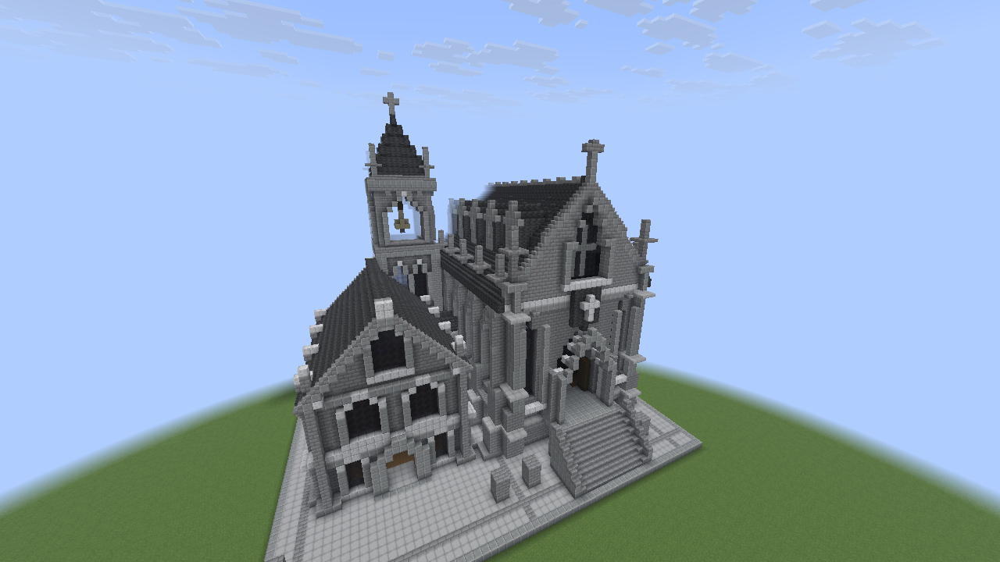

# Готический зал

Воспроизводимая постройка по [визуальному референсу](../references/gothic-hall-v1.png): большой зал с галереями, меньший двухэтажный корпус, соединительный переход и колокольня. Геометрию создают модули в `scripts/builds/gothic_hall/`, применение выполняет `scripts/build-gothic-hall.py` через проверяемые операции Paper-плагина.

Это адаптация референса доступной палитрой: каменный кирпич, андезит, диорит, тёмный сланец, древесина и затемнённое стекло. Шейдеры не используются. Детальная меблировка и ландшафт пока не выполнены; имеются терраса, лестницы, простые скамьи и помост. Колокол собран из блоков, без сущности колокола.

Постройка применена в живом мире: **29 354 блока, 87 пакетов**, итоговая проверка сохранена в `.runtime/gothic-hall/verification.json`.



Настоящий снимок Fabric-камеры от 12 сентября 2026 года, после финальной отделки. PNG сохранён без обработки; [метаданные снимка](gothic-hall-built.capture.json). Ракурс: `(0, -20, -63)`, yaw `25°`, pitch `16°`, FOV `85°`. Дальность тестового сервера — пять чанков, поэтому дальние края скрываются в тумане. Готовность кадра проверяется по клиенту; совпадение блоков с чертежом проверено отдельно чтением мира.

Начало локальных координат — **origin = (-50, -60, -40)**. Мировая координата получается прибавлением origin к локальной. Все диапазоны ниже включают обе границы; главные фасады обращены на север, в сторону `−Z`.

- Терраса: локально `X=1..63, Z=1..62, Y=0`, размер **63 × 62**. В мире: `X=-49..13, Z=-39..22, Y=-60`.
- Большой зал: основной корпус `X=7..31, Z=13..56`, размер **25 × 44**; с декором занимает `X=3..35, Z=8..57, Y=0..48`. Основной пол на `Y=6`, галереи на `Y=16`, конёк на `Y=43`. Главный вход около мировой точки **(-31, -53, -31)**.
- Боковой корпус: основное пятно `X=38..57, Z=16..41`, размер **20 × 26**; с выступами `X=36..59, Z=13..43, Y=0..28`. Полы на `Y=0/8`, конёк на `Y=28`. Вход около **(-3, -59, -26)**.
- Колокольня: с выступами `X=34..46, Z=42..56, Y=0..60`, размер **13 × 15**, 61 уровень блоков. Вершина в мире на `Y=0`; вход около **(-10, -58, 2)**.
- Соединительный переход: `X=31..40, Z=33..43, Y=0..16`; проход в полосе `Z=36..39` поднимается с пола большого зала `Y=6` к полу бокового корпуса `Y=8`.

Команды выполняются из корня репозитория при запущенном Paper-сервере, подключённом владельце проекта и загруженных чанках стройплощадки. Скрипт читает область проекта и отдельный агентский токен из приватного `.runtime/server/plugins/MinecraftBuilderMCP/config.yml`.

```bash
python3 scripts/build-gothic-hall.py plan
python3 scripts/build-gothic-hall.py apply
python3 scripts/build-gothic-hall.py verify
```

`plan` сохраняет `.runtime/gothic-hall/manifest.json`, проверяет палитру, границы проекта и точность сжатия геометрии в рецепты. Мир эта команда не меняет. `apply` перед каждым новым пакетом проверяет, что его область пуста, затем выполняет `build_prepare` и `build_apply`. Состояния блоков в сохранённом плане также должны ожидать воздух. `verify` сравнивает записанные блоки с результатом в мире и сохраняет отчёт; пустые пространства вне записанной маски она не проверяет.

Журнал возобновления — `.runtime/gothic-hall/ledger.json`. В нём сохраняются хеш чертежа, планы, ключи идемпотентности, идентификаторы операций и их статусы. Повторный `apply` продолжает по этому журналу, используя существующие операции; завершённые пакеты заново не строятся. Также проверяются идентификатор мира и его эпоха.

Занятая область, ручное изменение ожидаемого блока, незавершённая или конфликтующая операция останавливают применение. `verify` сообщает расхождения, сохраняя ручные правки. При остановке нужно проверить указанную операцию и её серверный журнал; удалять ledger или автоматически создавать новый план поверх существующей постройки нельзя. Серверные планы находятся в `plugins/MinecraftBuilderMCP/journal/plans/` и нужны этому скрипту для применения и проверки.

Финальная отделка хранится отдельно от исходного чертежа: `scripts/finish-gothic-hall.py` заменяет 14 центральных плит наверший на целые каменные блоки и четыре блока перехода на ступени. Это убирает зазоры в шпилях и делает подъём между корпусами плавным. Используются отдельный план и `.runtime/gothic-hall/finish-ledger.json`.

```bash
python3 scripts/finish-gothic-hall.py plan
python3 scripts/finish-gothic-hall.py apply
python3 scripts/finish-gothic-hall.py verify
```

После отделки следует использовать последнюю команду: она проверяет исходную постройку с учётом 18 замен. Исходная `build-gothic-hall.py verify` ожидает прежние состояния этих блоков и сообщит о расхождениях.

Отделка применена операцией `682bb5bb-a1fe-4359-b687-06f7b1ce1005`. Повторная проверка всех 29 354 блоков прошла; отчёт — `.runtime/gothic-hall/finish-verification.json`. Мир сохранён через `save-all flush`.
