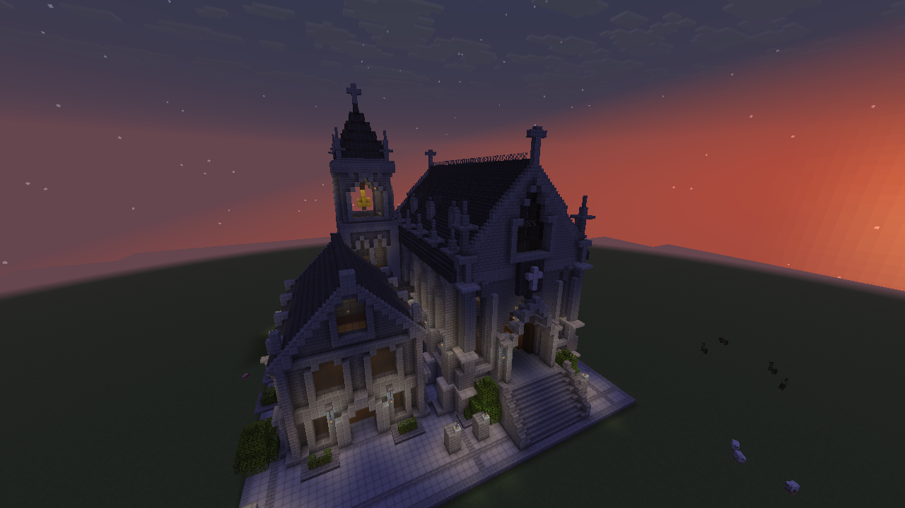
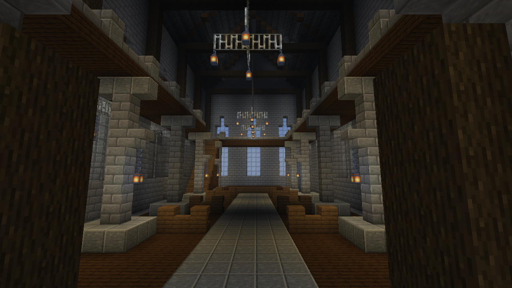

# Gothic Hall

## Polished version

The current build contains **30,125 blocks**, including **53 lanterns** and **642 persistent leaf blocks**. The polishing pass changed 4,569 positions across 87 checked operations: 1,489 additions, 718 removals, and 2,362 replacements.

The main roof now has six small dormers instead of ten large ones. A thin iron ridge and window mullions, quieter gray stone bands, and a gold block bell bring the architecture closer to the reference. Portal lights, courtyard lamps, three nave chandeliers, wing and tower lights, low planted beds, and six narrow trees complete the scene. The existing entrance, stairs, timber structure, and connecting passage remain usable.






These are unprocessed Minecraft framebuffer captures without shaders: [day metadata](gothic-hall-polished-day.capture.json), [evening metadata](gothic-hall-polished-evening.capture.json), and [interior metadata](gothic-hall-polished-interior.capture.json). The exterior views use the same position and angles as the original capture below, with the server view distance increased to 12 chunks.

The new geometry lives in `polish_architecture.py` and `polish_scene.py` alongside the frozen original modules. After constructing the baseline and its 18-block finishing pass, run:

```bash
python3 scripts/polish-gothic-hall.py plan
python3 scripts/polish-gothic-hall.py apply
python3 scripts/polish-gothic-hall.py verify
```

The manifest, ledger, and verification report are in `.runtime/gothic-hall/polish/`. Preparation checks the canonical baseline and the current blocks; a saved plan must still expect the same states. Every operation receives a durable idempotency key before application. The original manifests and ledgers are preserved.

Final verification checked **30,843 positions**, including all 30,125 occupied positions and 718 removals to air, across 90 inspection tiles. It explicitly reported eight planted soil blocks observed as grass rather than dirt. This allowance is limited to the newly introduced planter soil during verification; preparation and application still require exact current states, and other mismatches stop the script without overwriting them. The final operation was `e7f0371d-e64c-48e0-86ae-13ac813dab98`.

The world and journal were backed up locally before polishing, and the finished world was saved with `save-all flush`. The camera remains honest about its heuristic readiness: `serverRevisionVerified` is `false`; block verification is a separate server read. The old baseline verification commands below describe their historical stages and will report expected differences after this polishing pass.

## Original baseline

A reproducible build based on the [visual reference](../references/gothic-hall-v1.png): a large hall with galleries, a smaller two-story wing, a connecting passage, and a bell tower. Modules in `scripts/builds/gothic_hall/` generate the geometry; `scripts/build-gothic-hall.py` applies it through the Paper plugin's checked operations.

This report records the original baseline before subsequent decorative polishing. It adapts the reference to the available palette: stone bricks, andesite, diorite, dark deepslate, wood, and tinted glass. No shaders were used. Detailed furnishing and landscaping were not part of this baseline; it includes a terrace, stairs, simple benches, and a raised platform. The bell is built from blocks, without a bell entity.

The baseline was applied in the live world: **29,354 blocks in 87 batches**, with verification saved in `.runtime/gothic-hall/verification.json`.


A real Fabric camera capture from September 12, 2026, after the initial finishing pass. The PNG is unprocessed; [capture metadata](gothic-hall-built.capture.json). Viewpoint: `(0, -20, -63)`, yaw `25°`, pitch `16°`, FOV `85°`. The test server's view distance was five chunks for this original capture, so distant edges disappear into fog. The current local server has since been updated to 12 chunks for the polishing pass. Frame readiness is checked on the client; agreement between the blocks and the blueprint was verified separately by reading the world.

The local coordinate origin is **origin = (-50, -60, -40)**. Add this origin to a local coordinate to obtain its world coordinate. All ranges below are inclusive; the main facades face north, toward `−Z`.

- Terrace: local `X=1..63, Z=1..62, Y=0`, size **63 × 62**. World coordinates: `X=-49..13, Z=-39..22, Y=-60`.
- Large hall: main body `X=7..31, Z=13..56`, size **25 × 44**; with decoration it occupies `X=3..35, Z=8..57, Y=0..48`. Main floor at `Y=6`, galleries at `Y=16`, roof ridge at `Y=43`. Main entrance near world position **(-31, -53, -31)**.
- Side wing: main footprint `X=38..57, Z=16..41`, size **20 × 26**; including projections, `X=36..59, Z=13..43, Y=0..28`. Floors at `Y=0/8`, roof ridge at `Y=28`. Entrance near **(-3, -59, -26)**.
- Bell tower: including projections, `X=34..46, Z=42..56, Y=0..60`, size **13 × 15**, with 61 block levels. Its top is at world `Y=0`; entrance near **(-10, -58, 2)**.
- Connecting passage: `X=31..40, Z=33..43, Y=0..16`; the walkway in `Z=36..39` rises from the hall floor at `Y=6` to the wing floor at `Y=8`.

Run commands from the repository root with Paper running, the project owner connected, and the building site's chunks loaded. The script reads project scope and the separate agent token from the private `.runtime/server/plugins/MinecraftBuilderMCP/config.yml`.

```bash
python3 scripts/build-gothic-hall.py plan
python3 scripts/build-gothic-hall.py apply
python3 scripts/build-gothic-hall.py verify
```

`plan` saves `.runtime/gothic-hall/manifest.json` and checks the palette, project bounds, and exactness of geometry compression into recipes. It does not change the world. Before each new batch, `apply` checks that the target region is empty, then calls `build_prepare` and `build_apply`. Original block states in the saved plan must also be air. `verify` compares recorded blocks with the live world and saves a report; it does not check empty spaces outside the recorded mask.

The resume ledger is `.runtime/gothic-hall/ledger.json`. It stores the blueprint hash, plans, idempotency keys, operation IDs, and their statuses. Rerunning `apply` resumes from this ledger using existing operations; completed batches are not rebuilt. The world ID and epoch are also checked.

An occupied region, a manual change to an expected block, or an unfinished/conflicting operation stops application. `verify` reports mismatches while preserving manual edits. If application stops, inspect the reported operation and its server journal; do not delete the ledger or automatically create a new plan over the existing structure. Server plans live in `plugins/MinecraftBuilderMCP/journal/plans/` and are required by this script for application and verification.

The initial finishing pass is stored separately from the original blueprint: `scripts/finish-gothic-hall.py` replaces 14 central pinnacle slabs with full stone blocks and four passage blocks with stairs. This removes gaps in the spires and makes the ascent between the buildings smooth. It uses a separate plan and `.runtime/gothic-hall/finish-ledger.json`.

```bash
python3 scripts/finish-gothic-hall.py plan
python3 scripts/finish-gothic-hall.py apply
python3 scripts/finish-gothic-hall.py verify
```

After that finishing pass, use the last command: it verifies the original building with the 18 replacements applied. The original `build-gothic-hall.py verify` expects those blocks' previous states and will report mismatches.

The finishing pass was applied as operation `682bb5bb-a1fe-4359-b687-06f7b1ce1005`. Reverification of all 29,354 blocks passed; the report is `.runtime/gothic-hall/finish-verification.json`. The world was saved with `save-all flush`.
